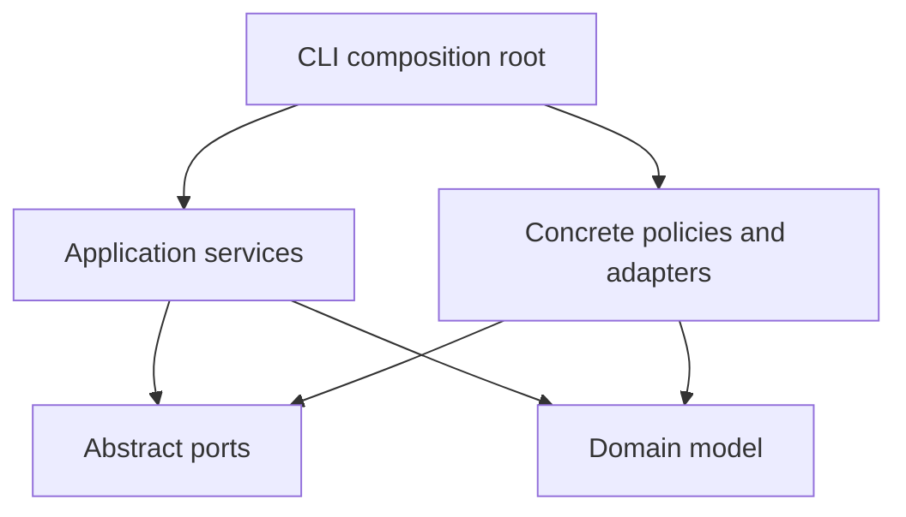
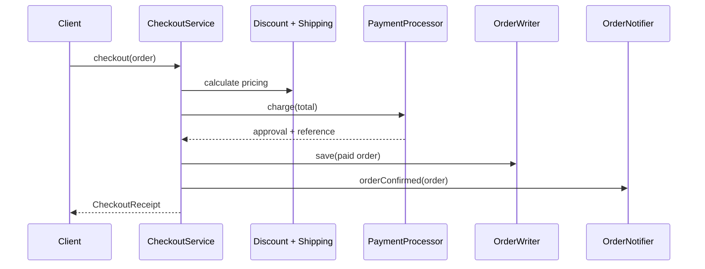
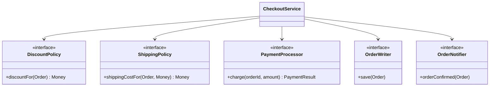

# Architecture and SOLID design

## Dependency direction

The domain and port layers do not include infrastructure headers. The application owns the
abstractions that it needs; outer layers implement those abstractions.

## Checkout collaboration

If payment is declined, the use case stops before storage and notification.

## Class model

## SOLID, principle by principle

### Single Responsibility Principle

Each unit has one reason to change:

- `Money` changes for monetary representation rules.
- `Order` changes for order invariants and lifecycle rules.
- `CheckoutService` changes for checkout sequencing.
- Discount and shipping policies change for one pricing rule.
- Repositories change for storage technology.
- Notifiers change for communication technology.

### Open/Closed Principle

`CheckoutService` contains no `switch` over discount, shipping, payment, storage, or notification
types. Extension happens by implementing a port. Existing tested orchestration stays closed to
modification.

### Liskov Substitution Principle

The `PaymentProcessor` contract states that any approved result contains a transaction ID and any
declined result is explicitly marked. Both built-in implementations pass the same reusable test.
The checkout use case does not know which implementation it receives.

### Interface Segregation Principle

Read and write persistence capabilities are separate. `OrderQueryService` cannot accidentally save
an order because it receives only `OrderReader`. `CheckoutService` receives only `OrderWriter` and
does not depend on query methods it never uses.

### Dependency Inversion Principle

`CheckoutService` is the high-level policy. It depends on interfaces declared in `ports/`, not on
the in-memory repository, console stream, sandbox card processor, or any other low-level detail.
`app/main.cpp` injects concrete objects at the application boundary.

## Design trade-offs

- The first release uses an in-memory repository to keep the example dependency-free and focused
  on architecture. A database adapter is a natural extension.
- Payment providers are deterministic simulations; no secrets or network calls are required.
- USD-style formatting is used for the demo. A currency-aware value object can be added without
  changing checkout orchestration.
